# Networking

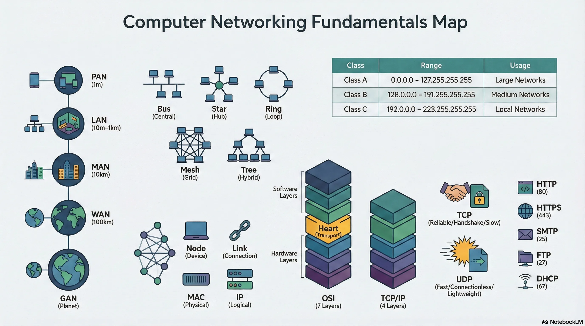

  <iframe
    src="https://www.youtube.com/embed/2lN_zjaOCy0?si=1BNWdKFdSOTnoamJ"
    title="YouTube video player"
    style="position:absolute;top:0;left:0;width:100%;height:100%;border:0;"
    allow="accelerometer; autoplay; clipboard-write; encrypted-media; gyroscope; picture-in-picture; web-share"
    referrerpolicy="strict-origin-when-cross-origin"
    allowfullscreen>
  </iframe>

## Basic Networking

### What is a Network?
**Definition**: According to Merriam Webster, a **Network** is usually an informally interconnected group or association of different entities (e.g., a person, computers, radio stations).

**Computer Network**: A system of peripherals or computers interconnected with each other.
- Has a standard communication channel established between them.
- Used to exchange different types of information and data.
- **Example**: Dominos has a network of 1232 branches across India.

### Importance of Computer Networks
- connects all different network-enabled devices.
- Enables data and information sharing between devices.
- Considered a core part of technical interviews and daily life.

### Network Classifications
Network types are classified based on the area of distribution.

#### Distance and Region Breakdown
*   **1m (Square meter)**: Personal Area Network
*   **10m (Room) - 1km (Campus)**: Local Area Network
*   **10km (City)**: Metropolitan Area Network
*   **100km (Country) - 1000km (Continent)**: Wide Area Network
*   **10,000km (Planet)**: The Internet (Global Area Network)

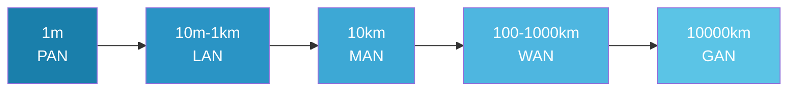

#### Types of Networks
1.  **PAN (Personal Area Network)**
    *   Lets devices connect and communicate over the range of a person.
    *   **Example**: Connecting Bluetooth devices.
2.  **LAN (Local Area Network)**
    *   A privately owned network operating within and nearby a single building (home, office, factory).
    *   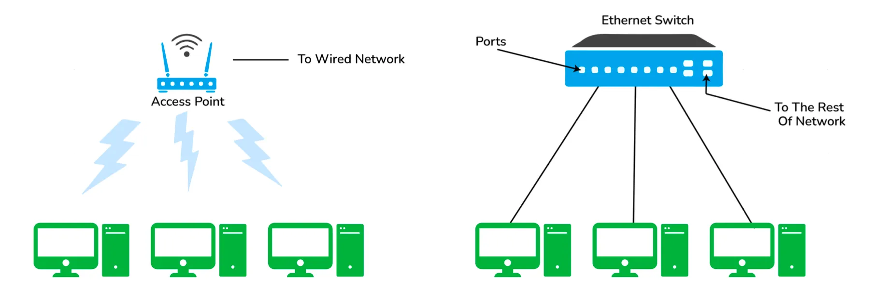
    *   Widely used to connect computers/laptops and consumer electronics.
    *   Enables sharing of resources (printers, fax machines) and information exchange.
    *   **Enterprise Networks**: LANs used by companies or organizations.
    *   **Types**:
        *   **Wireless LAN**: No wires involved; achieved using Wi-Fi. Popular where installing wire is difficult.
        *   **Wired LAN**: Achieved using LAN cable.
3.  **MAN (Metropolitan Area Network)**
    *   Connects and covers the whole city.
    *   **Example**: TV Cable connection over the city.
4.  **WAN (Wide Area Network)**
    *   Spans a large geographical area, often a country or continent.
    *   **Example**: The Internet is the largest WAN.
5.  **GAN (Global Area Network)**
    *   Also known as the Internet.
    *   Connects the globe using satellites.
    *   Called the Network of WANs.

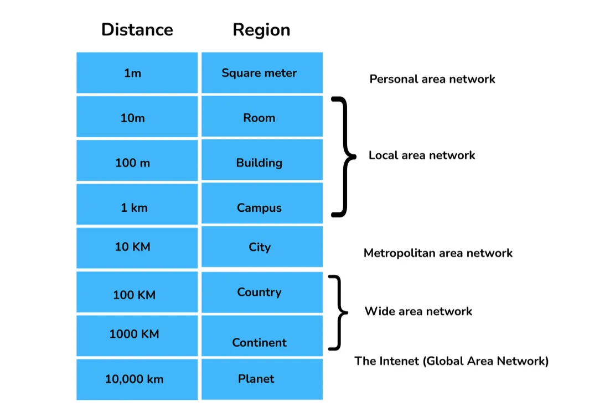

---

## VPN (Virtual Private Network)

### Definition
A **VPN** is a private WAN built on the internet.
- Allows creation of a **secured tunnel** (protected network) between different networks using the internet (public network).
- Enables clients to connect to an organization’s network remotely.
- 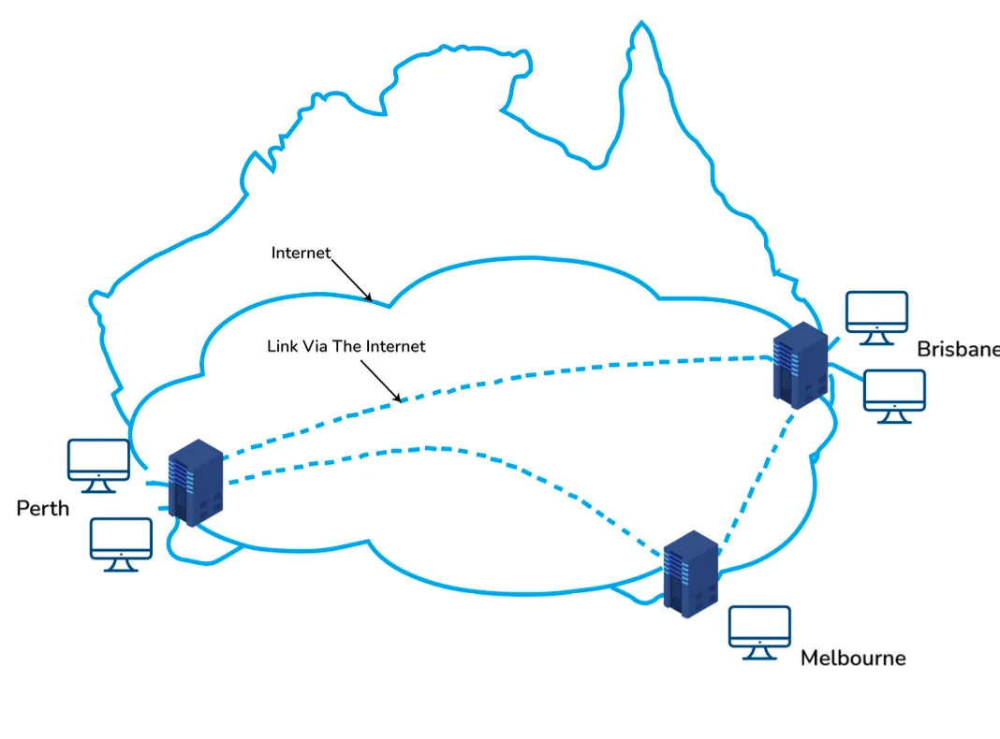

### Advantages
- Connects offices in different geographical locations remotely.
- **Cheaper** compared to WAN connections.
- Used for **secure transactions** and confidential data transfer between multiple offices.
- Keeps organization information **secured** against threats or intrusions via virtualization.
- **Encrypts** internet traffic and disguises online identity.

### Types of VPN
1.  **Access VPN**
    *   Provides connectivity to remote mobile users and telecommuters.
    *   Alternative to dial-up or ISDN connections.
    *   Low-cost solution with a wide range of connectivity.
2.  **Site-to-Site VPN (Router-to-Router)**
    *   Connects the network of one office to another in different locations.
    *   Common in large companies with multiple branches.
    *   **Sub-categories**:
        *   **Intranet VPN**: Connects remote offices using shared infrastructure (internet connectivity and servers) with the same accessibility policies as a private WAN.
        *   **Extranet VPN**: Uses shared infrastructure over an intranet to connect suppliers, customers, partners, and other entities using dedicated connections.

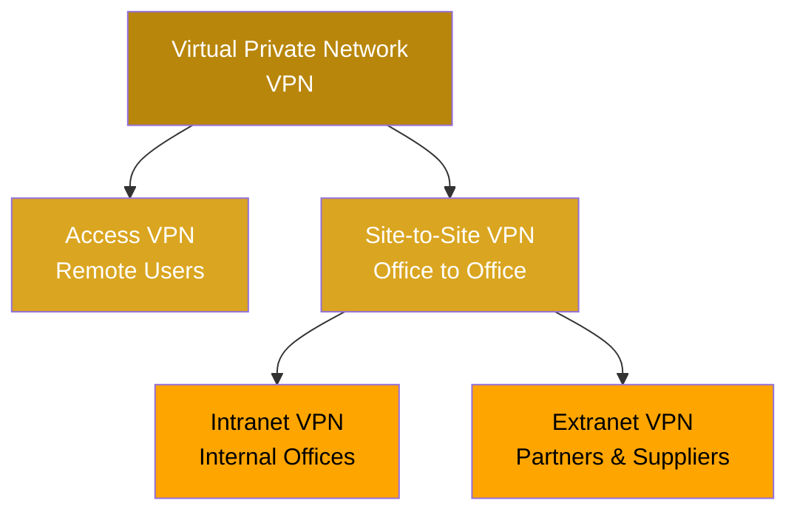

---

## Network Fundamentals

### Nodes and Links

*   **Node**: Any communicating device in a network.
    *   Point of intersection in a network.
    *   Can send/receive data.
    *   **Examples**: Computers, laptops, printers, servers, modems.
*   **Link**: The connectivity (edge) between two nodes in the network.
    *   Includes the type of connectivity (wired/wireless).
    *   Includes protocols used for communication.

### Network Topology
**Definition**: The physical layout of the network connecting different nodes using links. It depicts connectivity between computers, devices, and cables.

#### Types of Topologies
1.  **Bus Topology**
    *   All nodes connected using a central link known as the **bus**.
    *   **Pros**: Useful for a smaller number of devices.
    *   **Cons**: If the main cable gets damaged, the whole network is damaged.
2.  **Star Topology**
    *   All nodes connected to one single **central node**.
    *   **Pros**: More robust; easy to troubleshoot. Mainly used in home/office networks.
    *   **Cons**: If the central node fails, the complete network is damaged.
3.  **Ring Topology**
    *   Each node connected to exactly two nodes, forming a ring structure.
    *   **Cons**: Rare usage; expensive; hard to install and manage. If one node is damaged, the whole network is damaged.
4.  **Mesh Topology**
    *   Each node connected to one or many nodes.
    *   **Pros**: Robust (failure in one link only disconnects that node).
    *   **Cons**: Rare usage; installation and management are difficult.
5.  **Tree Topology**
    *   Combination of star and bus topology (Extended Bus Topology).
    *   All smaller star networks are connected to a single bus.
    *   **Cons**: If the main bus fails, the whole network is damaged.
6.  **Hybrid Topology**
    *   Combination of different topologies to form a new one.
    *   **Pros**: Ignores drawbacks of specific topologies and picks strengths from others.

---

## IP Addressing

### IPv4 Address
*   **Definition**: A 32-bit dynamic address of a node in the network.
*   **Structure**: 4 octets of 8-bits each (values up to 255).

### IPv4 Classes
Classes are based on the first octet and the number of hosts supported.

| Class | IPv4 Start Address | IPv4 End Address | Usage |
| :--- | :--- | :--- | :--- |
| **A** | 0.0.0.0 | 127.255.255.255 | Large Network |
| **B** | 128.0.0.0 | 191.255.255.255 | Medium Size Network |
| **C** | 192.0.0.0 | 223.255.255.255 | Local Area Network |
| **D** | 224.0.0.0 | 239.255.255.255 | Reserved for Multicasting |
| **E** | 240.0.0.0 | 255.255.255.254 | Study and R&D |

### Private and Special IP Addresses
**Private Address**: Specific IPs reserved for private use only. Non-routable on the Internet.

| Class | Private IPv4 Start Address | Private IPv4 End Address |
| :--- | :--- | :--- |
| **A** | 10.0.0.0 | 10.255.255.255 |
| **B** | 172.16.0.0 | 172.31.255.255 |
| **C** | 192.168.0.0 | 192.168.255.255 |

**Special Address**: Range `127.0.0.1` to `127.255.255.255`.
- Known as **loopback addresses**.
- Used for network testing.

### Subnet
*   **Definition**: A network inside a network achieved by **subnetting**.
*   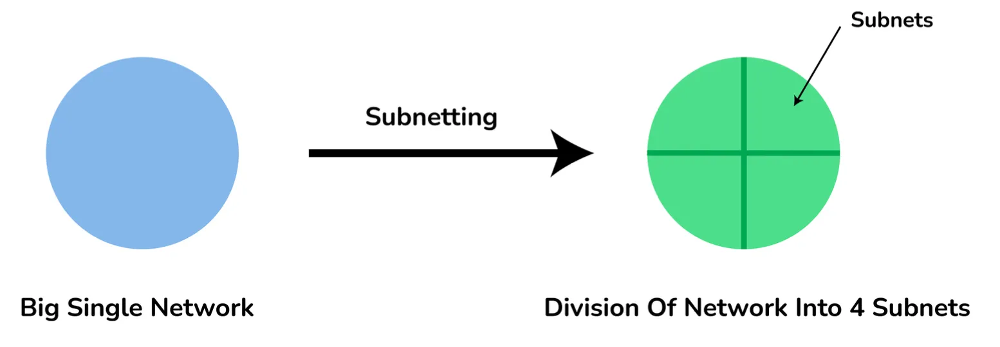
*   **Purpose**:
    *   Divides a network into subnets.
    *   Higher routing efficiency.
    *   Enhances network security.
    *   Reduces time to extract host address from routing table.

---

## Reference Models

### OSI Reference Model
**Open System Interconnections (OSI)** is a network architecture model based on ISO standards.
- Deals with connecting systems open for communication.
- Has **seven layers**.

#### Principles
- Create a new layer if a different abstraction is needed.
- Each layer has a well-defined function.
- Functions chosen based on internationally standardized protocols.

#### The 7 Layers
1.  **Physical** (Hardware Layer)
    *   **Unit**: Bit.
    *   **Description**: Transmits raw bits over communication channel. Selects transmission mode (Simplex, Half Duplex, Full Duplex).
2.  **Data Link** (Hardware Layer)
3.  **Network** (Hardware Layer)
4.  **Transport** (Heart of OSI)
5.  **Session** (Software Layer)
6.  **Presentation** (Software Layer)
7.  **Application** (Software Layer).

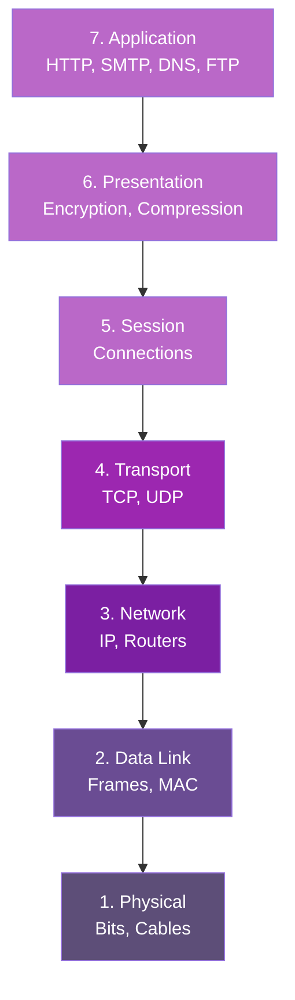

### TCP/IP Reference Model
Compressed version of the OSI model with **4 layers**.
- Developed by US DoD in the 1960s.
- 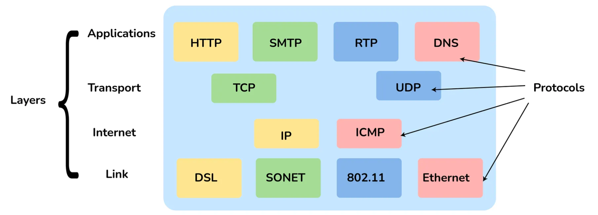
- Named after **TCP** (Transmission Control Protocol) and **IP** (Internet Protocol).

#### The 4 Layers
1.  **Link Layer**: Decides which links (serial lines, Ethernet) to use to meet connectionless internet layer needs.
2.  **Internet Layer**: Most important layer holding architecture together. Delivers IP packets to destinations.
3.  **Transport Layer**: Enables peer entities to carry on a conversation (similar to OSI Transport).
4.  **Application Layer**: Contains all higher-level protocols.

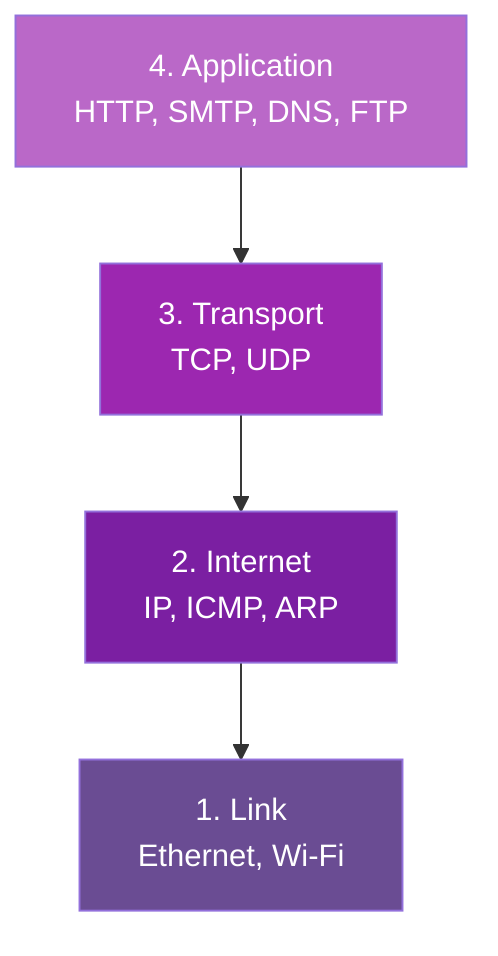

### OSI vs TCP/IP Comparison

| OSI Reference Model | TCP/IP Reference Model |
| :--- | :--- |
| 7 layered architecture | 4 layered architecture |
| Fixed boundaries and functionality for each layer | Flexible architecture with no strict boundaries |
| Low Reliability | High Reliability |
| Vertical Layer Approach | Horizontal Layer Approach |

**Note**: The Presentation and Session layers from OSI are not present in the TCP/IP model.

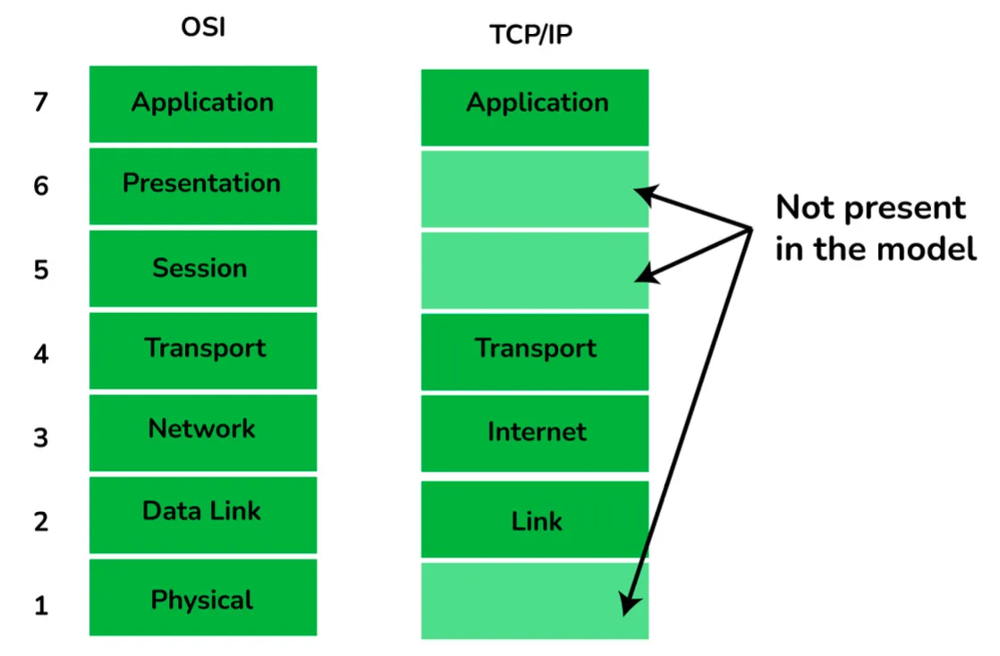

---

## Protocols

### HTTP and HTTPS
*   **HTTP (HyperText Transfer Protocol)**
    *   Defines rules for transmitting info on the WWW.
    *   Helps communication between web browsers and servers.
    *   **Stateless protocol** (each command is independent).
    *   Application layer protocol built on TCP.
    *   Default Port: **80**.
*   **HTTPS (HyperText Transfer Protocol Secure)**
    *   Advanced, secured version of HTTP.
    *   Uses **SSL/TLS** protocol on top of HTTP.
    *   Encrypts communication and identifies network servers securely.
    *   Default Port: **443**.

### SMTP (Simple Mail Transfer Protocol)
*   Sets rules for communication between servers to transmit emails.
*   Supports End-to-End and Store-and-Forward methods.
*   Always-listening mode.
*   Default Port: **25**.

### DNS (Domain Name System)
*   Decentralized, hierarchical naming system (Devices/Services directory of the Internet).
*   Translates domain names (e.g., `codingismeditation.github.io`) to IPs (e.g., `172.217.166.36`).
*   Default Port: **53**.

### TCP (Transmission Control Protocol)
*   Set of rules for connecting to the Internet and transmitting data.
*   Creates a virtual network when multiple computers connect.
*   Uses **three-way handshake** model.
*   **Reliable** connection.

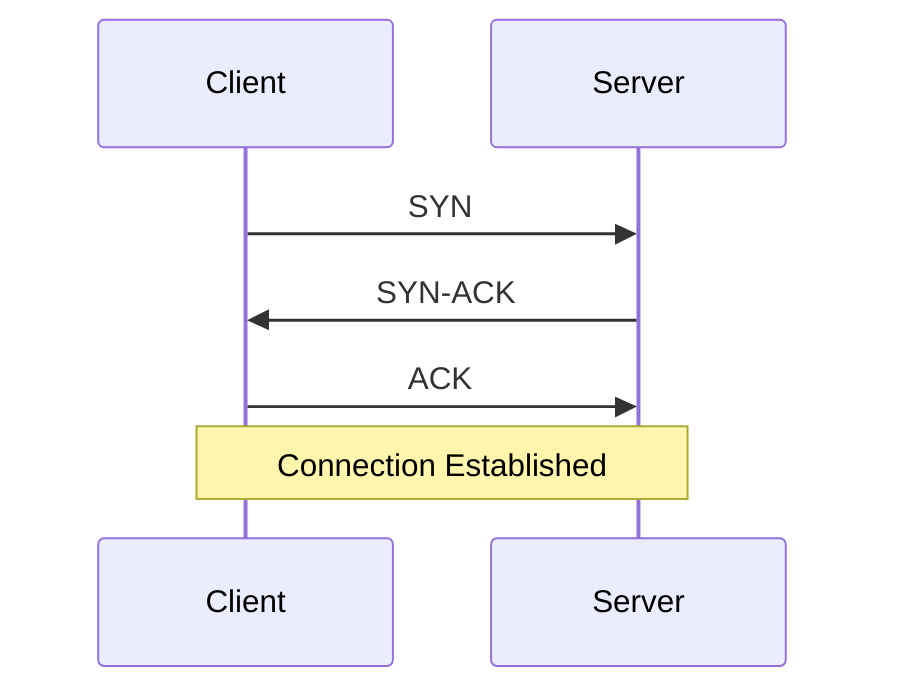

### UDP (User Datagram Protocol)
*   Based on Datagrams.
*   Used for **multicasting** and **broadcasting**.
*   **Simple transmission** without hand-shaking.
*   **Less reliable** than TCP.

### TCP vs UDP

| TCP / TCP/IP | UDP |
| :--- | :--- |
| Connection-Oriented Protocol | Connectionless Protocol |
| More Reliable | Less Reliable |
| Slower Transmission | Faster Transmission |
| Packet order preserved/rearranged | Packet order not fixed; independent packets |
| Uses three-way handshake | No handshake |
| Heavy-weight packets | Light-weight packets |
| Error checking mechanism | No error checking mechanism |
| **Protocols**: HTTP, FTP, Telnet, SMTP, HTTPS | **Protocols**: DNS, RIP, SNMP, RTP, BOOTP, TFTP, NIP |

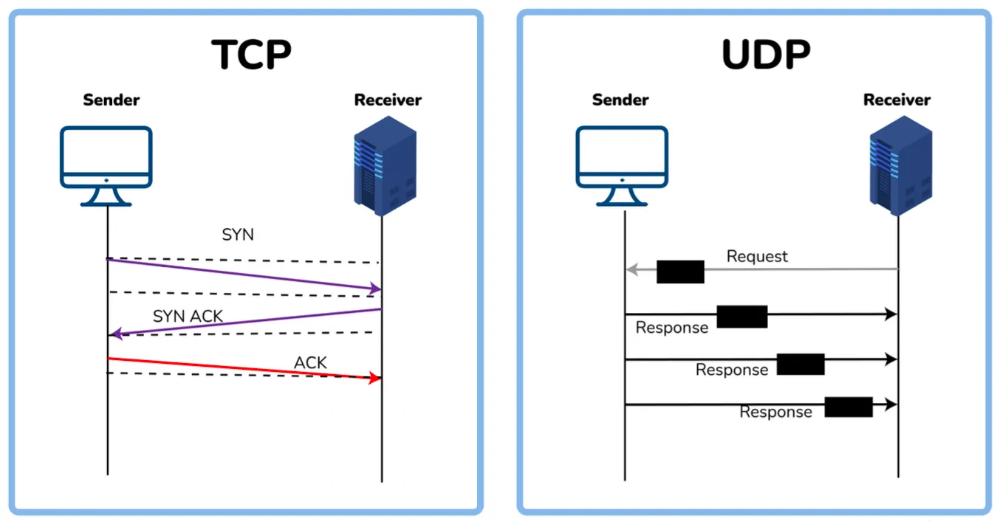

### ICMP (Internet Control Message Protocol)
*   Network layer protocol for **error handling**.
*   Used by network devices (routers) to diagnose issues.
*   Reports errors and tests if data reaches destination.
*   Default Port: **7**.

### DHCP (Dynamic Host Configuration Protocol)
*   Application layer protocol to **auto-configure devices** on IP networks.
*   Auto-assigns IPs, subnet masks, and DNS settings.
*   Enables use of TCP/UDP-based protocols.
*   Default Port: **67**.

### ARP (Address Resolution Protocol)
*   Network-level protocol.
*   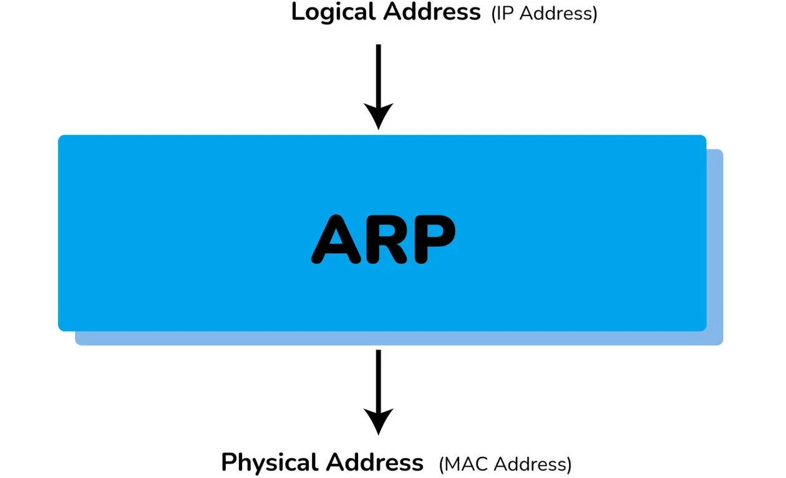
*   Converts **Logical Address (IP)** to **Physical Address (MAC)**.
*   Used to get MAC address of devices for local network communication.

### FTP (File Transfer Protocol)
*   Application layer protocol.
*   Used to transfer files/data reliably between hosts.
*   Used to download files from remote servers.
*   Default Port: **27**.

---

## Hardware and Devices

### Router vs Gateway
*   **Router**:
    *   Connects two or more network segments.
    *   Directs traffic; transfers data (packets) from source to destination.
    *   Operates at **Network Layer**.
    *   Sends data to **similar** networks.
*   **Gateway**:
    *   Routes and regulates traffic.
    *   Can send data between two **dissimilar** networks.

### Hub vs Switch

| Hub | Switch |
| :--- | :--- |
| Operates at **Physical Layer** | Operates at **Data Link Layer** |
| **Half-Duplex** transmission mode | **Full-Duplex** transmission mode |
| Connects Ethernet devices | Connects LAN devices |
| Less complex, less intelligent, cheaper | Intelligent and effective |
| No software support for administration | Administration software support present |
| Less speed (up to 100 MBPS) | High speed (GBPS) |
| Less efficient (collisions possible) | More efficient (avoids/reduces collisions) |

### MAC Address vs NIC
*   **MAC (Media Access Control) Address**:
    *   48-bit or 64-bit unique identifier.
    *   Physical address embedded with the NIC.
    *   Used at **Data Link Layer**.
*   **NIC (Network Interface Card)**:
    *   Hardware component enabling device connection to the network.

### MAC Address vs IP Address

| MAC Address | IP Address |
| :--- | :--- |
| Media Access Control Address | Internet Protocol Address |
| 6 or 8-byte hexadecimal number | 4 (IPv4) or 16 (IPv6) Byte address |
| Embedded with NIC | Obtained from the network |
| Physical Address | Logical Address |
| Operates at Data Link Layer | Operates at Network Layer |
| Identifies the device | Identifies device connectivity on the network |

### Firewall
*   Network security system monitoring incoming/outgoing traffic.
*   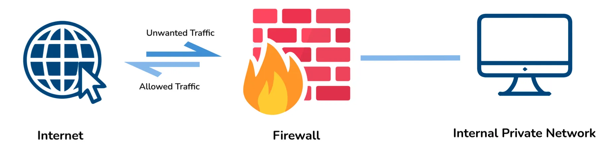
*   Blocks traffic based on security policies.
*   Acts as a **wall** between internet (public) and networking devices (private).
*   Can be hardware, software, or both.

---

## Commands and Operations

### ipconfig vs ifconfig

| ipconfig | ifconfig |
| :--- | :--- |
| Internet Protocol Configuration | Interface Configuration |
| Used in **Microsoft** OS | Used in **MAC, Linux, UNIX** OS |
| View/configure network interfaces | View/configure network interfaces |
| TCP/IP summary, change DHCP/DNS settings | |

### Casting Types
*   **Unicasting**: Message sent to a **single node** from source.
    *   Use: Establishing new connection.
*   **Anycasting**: Message sent to **any** node from source.
    *   Use: Content Delivery Systems (getting content from any server).
*   **Multicasting**: Message sent to a **subset of nodes**.
    *   Use: Sending same data to multiple receivers.
*   **Broadcasting**: Message sent to **all nodes** in a network.
    *   Use: DHCP and ARP in local network.

### Browser Process (Entering google.com)
Steps followed when entering a URL:
1.  **Check Cache**: Browser checks its cache for fresh content.
2.  **DNS Lookup**:
    *   If IP not in cache (browser/OS), request OS to do DNS lookup.
    *   Uses **UDP** to get IP from DNS server.
3.  **TCP Connection**:
    *   Establish new connection between browser and server.
    *   Uses **three-way handshaking**.
4.  **HTTP Request**: Sent to server using TCP connection.
5.  **HTTP Response**: Web server handles request and sends response.
6.  **Process Response**:
    *   Browser processes response.
    *   Closes TCP connection or reuses it.
7.  **Cache & Render**:
    *   Browser caches data if cacheable.
    *   Browser decodes and renders content.

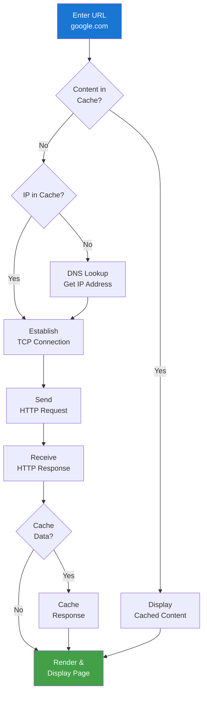

---

## Global Connectivity Fact
*   **Submarine Cables**: As of 2021, there are **1.3 million kilometers** of submarine optical fiber cables globally.
*   **Scale**: Enough to revolve around the earth more than **100 times**.

---

## Complete Networking Roadmap

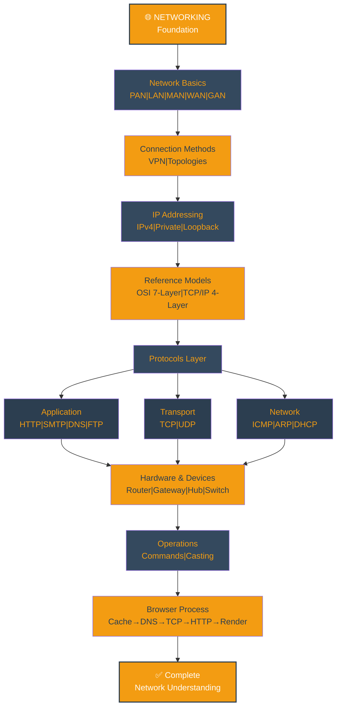